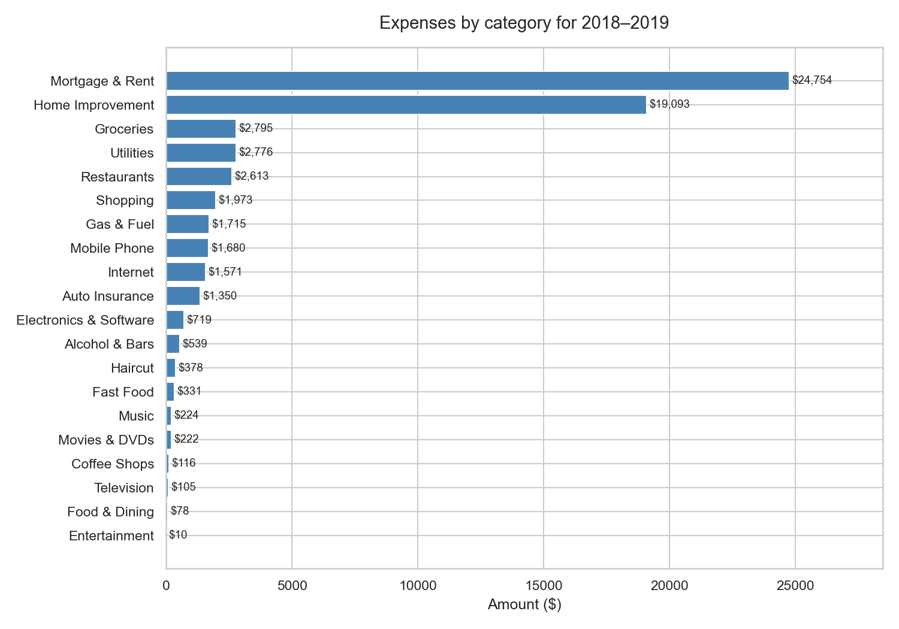
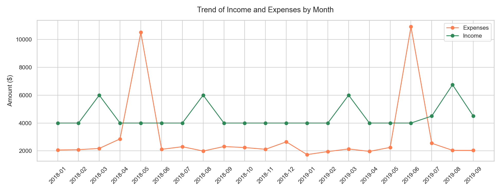
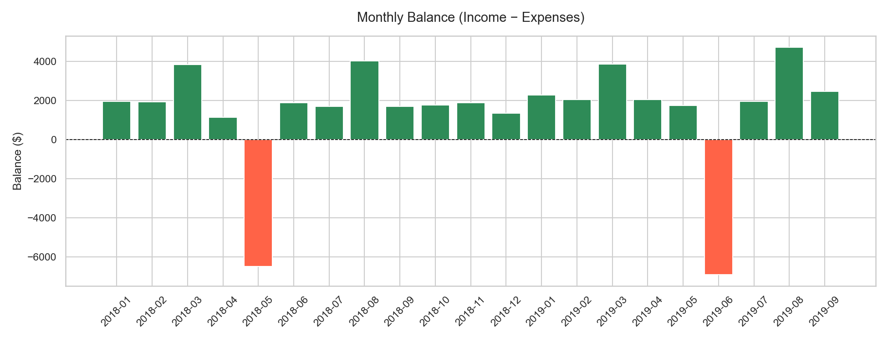
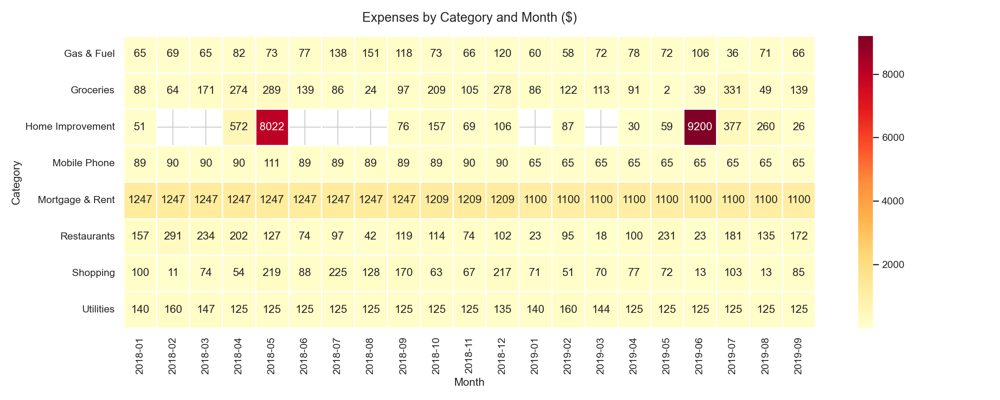
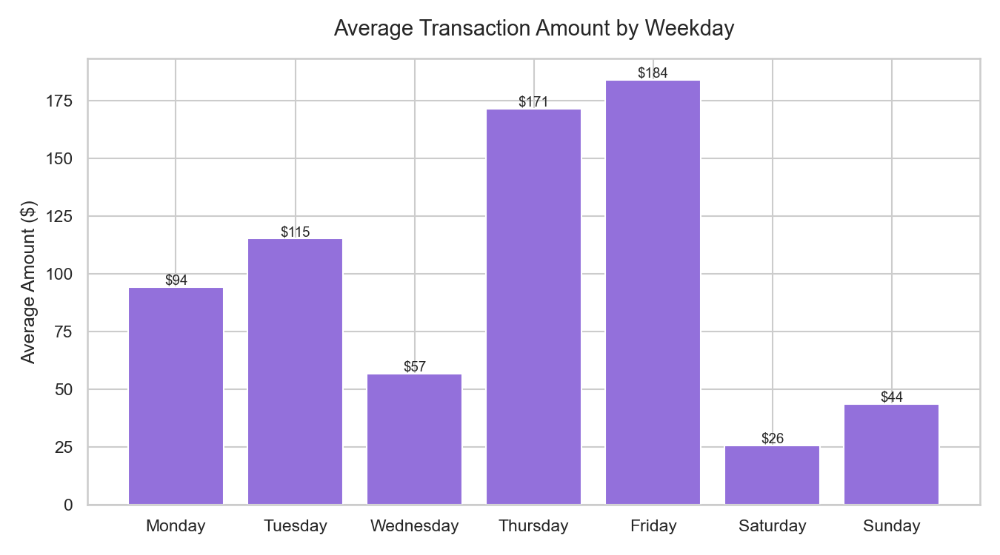

# Personal Finance Analysis

> A exploratory data analysis project uncovering spending patterns,
> budget balance, and financial anomalies from 21 months of
> personal transaction data (2018–2019).


---

## Overview

This project analyzes 800+ personal financial transactions
to answer three core business questions:

- Where does most of the money go?
- Is the monthly budget balanced?
- How is spending distributed across accounts?

The full pipeline covers data exploration, cleaning, EDA,
visualization, and SQL-based insights — built to mirror
a real-world analytics workflow.

---

## Tech Stack

| Tool | Purpose |
|------|---------|
| Python 3.11 | Core language |
| Pandas | Data manipulation |
| Matplotlib / Seaborn | Visualizations |
| SQLite3 | SQL-based analysis |
| Jupyter Notebook | Interactive environment |

---

## Features

- **Data Cleaning** — date parsing, removal of internal
  transfers (Credit Card Payments), debit/credit separation
- **EDA** — category breakdown, monthly trends,
  income vs. expenses balance
- **Visualizations** — 5 charts including heatmap,
  balance chart, and weekday spending pattern
- **SQL Layer** — all key aggregations reproduced
  in pure SQL via sqlite3
- **Storytelling** — every notebook includes markdown
  commentary explaining the "why" behind each finding

---

## Installation

```bash
# 1. Clone the repository
git clone https://github.com/your-username/personal-finance-analysis.git
cd personal-finance-analysis

# 2. Create and activate virtual environment
python -m venv venv

# Windows
venv\Scripts\activate

# Mac / Linux
source venv/bin/activate

# 3. Install dependencies
pip install pandas matplotlib seaborn jupyter
```

---

## Usage

Open notebooks in order — each one builds on the previous:

```bash
jupyter notebook
```

| # | Notebook | Description |
|---|----------|-------------|
| 1 | `1_exploration.ipynb` | Dataset structure, dtypes, nulls |
| 2 | `2_cleaning.ipynb` | Date parsing, filtering, splitting |
| 3 | `3_eda.ipynb` | Core business questions |
| 4 | `4_visualizations.ipynb` | Charts and visual insights |
| 5 | `5_insights.ipynb` | SQL aggregations via `sqlite3` |

---

## Key Findings

- **Mortgage & Home Improvement** account for **72%**
  of all spending over 21 months
- **19 out of 21 months** closed with a positive balance
  of ~$1,700–$2,000
- Two months went deeply negative: May 2018 (-$6,507)
  and June 2019 (-$6,912), likely driven by home improvement costs
- **Food-related spending** (groceries + restaurants + coffee)
  totals **$5,931** — third largest category overall
- **Friday** is the most expensive weekday (avg. $183/transaction)
  — 3× higher than Saturday ($25)

---

## Visualizations

> Screenshots from `charts/` folder

| Chart | Preview |
|-------|---------|
| Category Breakdown |  |
| Monthly Trend |  |
| Balance Chart |  |
| Heatmap |  |
| Weekday Pattern |  |

---

## Roadmap

- [ ] Add interactive dashboard (Tableau Public / Power BI)
- [ ] Automate monthly budget report generation
- [ ] Add category forecasting with linear regression
- [ ] Build a reusable pipeline for any transaction CSV

---

## License

This project is licensed under the MIT License.